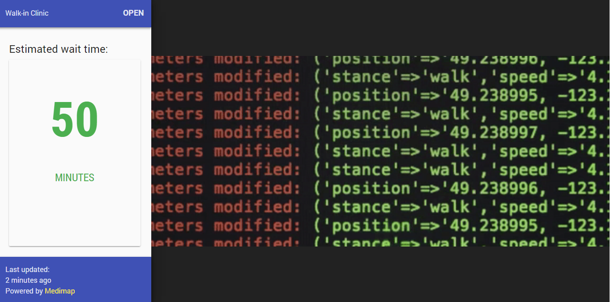

# NOMC-medimap-viewer

Medimap widget viewer + announcement slideshow for the North Okanagan Medical Clinic, running on a Raspberry Pi.

## I'm sorry, what?
My father works as a doctor at the [North Okanagan Medical Clinic](http://www.health-local.com/biz/walk-in-clinics/vernon/british-columbia/north-okanagan-medical-clinic/), and wanted a display running off a Raspberry Pi that could display info from [medimap.ca](https://medimap.ca) as well as a slideshow for announcements. I decided to run this off a Reveal.js slideshow.

## `npm` scripts
NOMC-medimap-viewer uses [`scripty`](https://github.com/testdouble/scripty) to organize npm scripts. The scripts are defined in the [`scripts` directory](./scripts), and replicated in [`scripts-win`](./scripts-win) for compatibility. In `package.json` you'll see the word `scripty` as opposed to the script content you'd expect. For more info, see [scripty's GitHub](https://github.com/testdouble/scripty).

| Script             | Description     |
| :----------------- | :------------------------------------------------------------------------ |
| `start`            | Run development server with webpack hot reloading.                        |
| `start:production` | Run production server with **NO** webpack hot reloading. You'll probably want to run `build` before this. |
| `build`            | Builds css & javascript in production configuration with webpack.         |
| `lint`             | Lint javascript with `eslint .`.                                          |
| `lint:fix`         | Lint & partially fix javascript with `eslint . --fix`.                    |
| `test`             | Yell about the lack of unit tests and exit with an error code of 1 :grin: |

More info will be added as I figure out what I need to do.

---
[LICENSE](./LICENSE)
